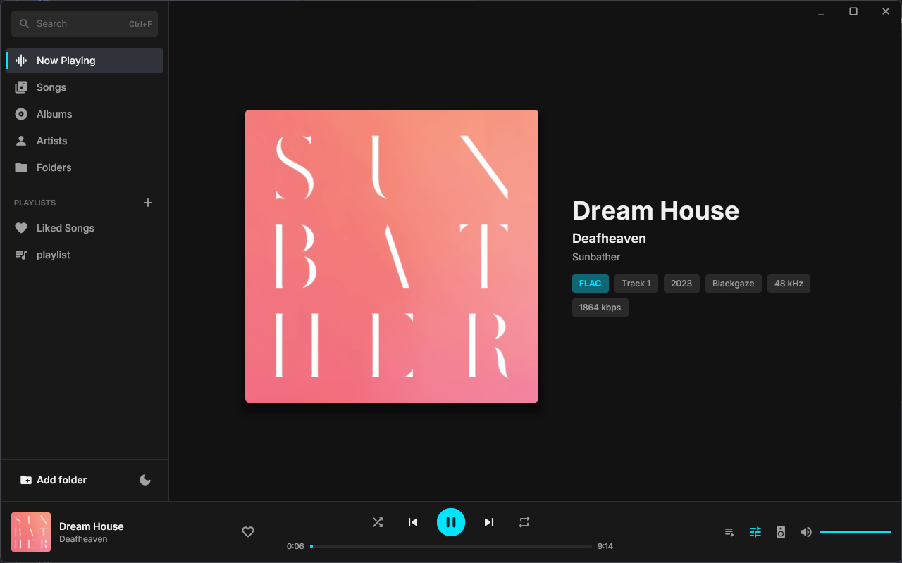
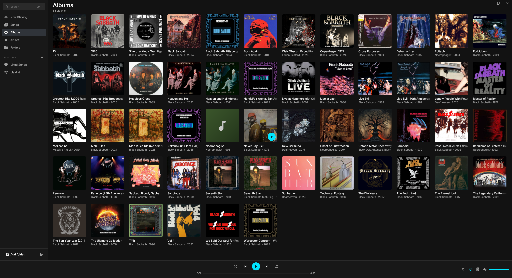
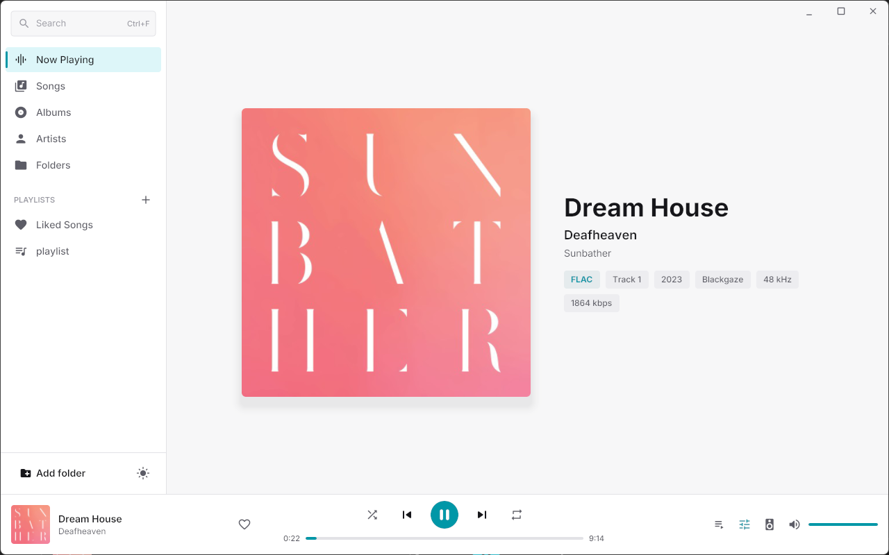

# Personal Music Player

A Windows desktop music player written in Go: a music library with albums, artists, folders, playlists and a queue, in a three-pane interface drawn with [Gio](https://gioui.org). Audio is decoded by FFmpeg and played through miniaudio (both through cgo); FFmpeg also reads and writes the tags.

| Songs | Albums | Light theme |
|---|---|---|
|  |  |  |

## Features

- **Library**: add music folders (watched: new, changed and deleted files are picked up at every start) or single files, by the *Add folder* button or by dropping folders and files from Explorer anywhere on the window. Tags are cached, so large libraries open instantly; scanning runs on background threads.
- **Views**: Songs (a sortable-by-artist table), Albums (cover grid), Artists, Folders, Liked Songs, your playlists, and search across titles, artists and albums (<kbd>Ctrl</kbd>+<kbd>F</kbd>). Narrow windows collapse the sidebar to an icon rail and drop table columns.
- **Queue**: *Now Playing*, *Up Next* (tracks you queue with *Play Next* / *Add to Queue* or by dragging) and *From: …* (the rest of the list you started). Starting another list never discards Up Next, and replacing the list can be undone from the toast or with <kbd>Ctrl</kbd>+<kbd>Z</kbd>.
- **Desktop interactions**: multi-select with <kbd>Ctrl</kbd>/<kbd>Shift</kbd>, double-click to play, right-click menus (Play Next, Add to Queue, Add to Playlist, Go to Artist/Album, Show in File Explorer, Edit Metadata, Remove), drag tracks onto playlists or into the queue, reorder playlists and Up Next by dragging. Long titles fade out and show the full text on hover.
- **Playlists**: create, rename, reorder, import `.m3u`/`.m3u8` (drop them on the window), export as M3U; a Liked Songs list with a heart in the playback bar.
- **Metadata editor**: title, artist, album, album artist, genre, year, track and disc, written into the file without re-encoding (FFmpeg remux; covers are kept, except in Ogg and WAV files).
- **Playback**: FLAC, MP3, WAV, OGG Vorbis, M4A and AAC, decoded by FFmpeg and played through a lock-free ring buffer and miniaudio, with sample-exact seeking.
- **Now Playing** view with the cover, format details and synced lyrics (embedded LRC, ID3 SYLT or a sidecar `.lrc` in UTF-8/16/32, Shift-JIS, GBK or Windows-1252), karaoke-style with word highlighting for enhanced LRC, and a per-track timing offset.
- **Design**: dark (default) and light themes, following Windows or set by the button in the sidebar; Inter typeface (bundled); cyan accent; missing covers get a generated gradient per album.
- **Windows integration**: media keys and the volume / lock-screen overlay through SystemMediaTransportControls (no global hotkeys), a tray icon (minimizing hides into it), native file and folder dialogs.
- **Audio output**: device picker (remembered; unplugging falls back to the default and switches back), exclusive mode (WASAPI) with bit-perfect output for integer PCM, and a 10-band equalizer with presets and true bypass.

### Keyboard

Shortcuts are off while a text field has the focus (except <kbd>Esc</kbd>).

| Key | Action |
|---|---|
| <kbd>Space</kbd> | Play / pause |
| <kbd>Ctrl</kbd>+<kbd>F</kbd> | Search |
| <kbd>Esc</kbd> | Close a menu, dialog or the queue; clear the search |
| <kbd>↑</kbd> / <kbd>↓</kbd> (<kbd>Shift</kbd> extends) | Move the selection |
| <kbd>Enter</kbd> | Play the selected track |
| <kbd>Ctrl</kbd>+<kbd>Shift</kbd>+<kbd>Enter</kbd> / <kbd>Ctrl</kbd>+<kbd>Q</kbd> | Play next / add to queue |
| <kbd>Ctrl</kbd>+<kbd>A</kbd> | Select all |
| <kbd>Ctrl</kbd>+<kbd>I</kbd> | Edit metadata |
| <kbd>Ctrl</kbd>+<kbd>Shift</kbd>+<kbd>E</kbd> | Show in File Explorer |
| <kbd>Delete</kbd> | Remove from the library (from the playlist in a playlist view) |
| <kbd>Shift</kbd>+<kbd>←</kbd> / <kbd>→</kbd> | Seek −10 s / +10 s |
| <kbd>Ctrl</kbd>+<kbd>←</kbd> / <kbd>→</kbd> | Previous / next track |
| <kbd>Ctrl</kbd>+<kbd>Z</kbd> | Undo replacing the queue |

Files and folders passed on the command line ("Open with") are added to the library and played.

Settings live in `%AppData%\MusicPlayer\settings.json`, the library (tags cache, playlists, likes) in `library.json` next to it.

## Project structure

```
personal-music-player/
├── cmd/
│   ├── musicplayer/       Entry point: window, tray, media controls, dialogs, drag and drop (+ Windows resources)
│   └── mkicon/            Generates the application icon for the executable
├── internal/
│   ├── audio/             FFmpeg decoder, miniaudio backend (ring buffer, clock, exclusive mode), engine
│   ├── eq/                Equalizer design (RBJ peaking biquads) and the real-time DSP chain
│   ├── metadata/          Tags / covers / lyrics via FFmpeg, ID3 SYLT, tag writer, cover cache, background service
│   ├── library/           The library: watched folders, cached tags, views, playlists, likes
│   ├── queue/             Now Playing, Up Next and the playing context; shuffle, repeat, history, undo
│   ├── lyrics/            LRC parser (enhanced word timing) and encoding detection
│   ├── player/            Facade that wires engine, library, queue, metadata and lyrics together
│   ├── core/              The single logical "UI thread": a lock plus a work queue and timers
│   ├── settings/          JSON settings store
│   ├── ui/                Gio interface: sidebar, track tables, album grid, queue drawer, menus, dialogs
│   └── win/               Windows integration: SMTC (WinRT via COM), tray, dialogs, OLE drop target, window
├── assets/
│   ├── fonts/             Inter and Material Icons (embedded into the executable)
│   └── screenshots/       Images used in this README
├── installer/
│   └── musicplayer.iss    Inno Setup script for the Windows installer
├── lib/
│   └── miniaudio/         Vendored single-header audio library (compiled by cgo)
└── scripts/
    └── build.ps1          Build, package, installer and test
```
## Prerequisites

- Windows 10 or 11, 64-bit (x64)
- [Go](https://go.dev/dl/) 1.27 or newer
- [MSYS2](https://www.msys2.org/), which supplies the C compiler for cgo, `pkg-config` and FFmpeg. Install it either way:
  - with [Scoop](https://scoop.sh/): `scoop install msys2`, then run `msys2` once to finish the setup
  - or with the installer from msys2.org (the default location is `C:\msys64`)

Then install the toolchain and FFmpeg from the **MSYS2 UCRT64** shell:

```bash
pacman -Syu        # if the shell closes to finish the update, reopen UCRT64 and run it again
pacman -S --needed mingw-w64-ucrt-x86_64-{toolchain,pkgconf,ffmpeg}
```

| Package | Provides |
|---|---|
| `toolchain` | GCC for cgo, `windres` (the executable's icon and version info) and `objdump` (used to collect DLLs) |
| `pkgconf` | pkg-config, used by cgo to find FFmpeg |
| `ffmpeg` | `libavformat`, `libavcodec`, `libswresample`, `libavutil`, and the `ffmpeg` tool the tests use to make fixtures |

miniaudio is included in `lib/miniaudio`, and Gio is fetched by Go, so nothing else needs installing.

## Build

From PowerShell at the repository root:

```powershell
.\scripts\build.ps1
```

The script finds MSYS2's `ucrt64` folder (from `$env:MSYS2_UCRT64`, a Scoop install, or `C:\msys64\ucrt64`), puts it on `PATH` for cgo, builds `build\MusicPlayer\musicplayer.exe`, and copies every DLL it needs (FFmpeg, its codec libraries and the MinGW runtime) next to it, so the folder runs on any Windows x64 PC without MSYS2. The folder is about 145 MB, almost all of it MSYS2's FFmpeg, which links every codec library it ships.

| Option | Effect |
|---|---|
| `-Package` | also writes `build\MusicPlayer-windows-x64.zip` |
| `-Installer` | also writes `build\MusicPlayer-<version>-setup-x64.exe` (see [Installer](#installer)) |
| `-Console` | keeps a console window, for log output while debugging |
| `-Test` | runs the test suite instead |

To build by hand, put `ucrt64\bin` on `PATH` and enable cgo:

```powershell
$env:PATH = "C:\msys64\ucrt64\bin;$env:PATH"   # or ~\scoop\apps\msys2\current\ucrt64\bin
$env:CGO_ENABLED = 1
go build -ldflags "-H windowsgui" -o musicplayer.exe ./cmd/musicplayer
```

An executable built this way needs `ucrt64\bin` on `PATH` to find the FFmpeg DLLs when it runs.

### Installer

`.\scripts\build.ps1 -Installer` builds the app and compiles [installer/musicplayer.iss](installer/musicplayer.iss) with [Inno Setup 6](https://jrsoftware.org/isinfo.php) (`scoop install extras/inno-setup` or `winget install JRSoftware.InnoSetup`). The version comes from the executable's version resource (`cmd/musicplayer/musicplayer.rc`).

The setup installs for the current user without administrator rights (or for all users, if chosen in the setup), adds a Start menu shortcut and optionally a desktop one, and registers the player under *Open with* and in *Settings → Apps → Default apps* for the supported audio formats and `.m3u`/`.m3u8`, without changing existing defaults. Uninstalling removes all of that and asks whether to delete the library and settings in `%AppData%\MusicPlayer` (kept by default, and always kept by a silent uninstall).

Unattended install: `MusicPlayer-<version>-setup-x64.exe /VERYSILENT /CURRENTUSER` (or `/ALLUSERS`).

## Tests

```powershell
.\scripts\build.ps1 -Test
```

- **audio**: decoder seek accuracy per format (bit-exact for WAV/FLAC, within one frame for MP3/M4A/OGG); real-time playback, pause, seeks and end of stream on miniaudio's null device; the playback clock's smoothness and lyric-switch timing; bit-perfect exclusive-mode output for 16/24-bit WAV and FLAC (including devices that only accept packed 24-bit or 32-bit); device loss and fallback
- **eq**: measured magnitude response against the analytical one, true bypass when flat, no clicks while parameters change, CPU cost
- **metadata**: tags, covers, ReplayGain, SYLT, sidecar `.lrc` files and their encodings, parallel scanning and cancellation, M3U parsing
- **lyrics**: parsing, encodings, 30,000 fuzzed inputs
- **library**: watched folders, rescans picking up new and deleted files, album/artist/folder views, search, playlists and likes surviving a restart
- **queue**: Up Next vs. context, replacing and undoing, repeat and shuffle, removal of tracks that left the library
- **metadata** also covers the tag writer (FLAC and MP3 round trips keep the cover and other tags)
- **ui**: the interface driven headlessly through Gio's input router: double-click to play, multi-select and the context menu, keyboard shortcuts, the delete confirmation, dragging onto a playlist and into the queue, and every view at several window sizes

`go test ./internal/ui -run TestScreenshots` with `MP_SHOTS=<dir>` and `MP_SHOTS_LIBRARY=<music folder>` renders the views to PNG files offscreen (how the screenshots above were made).

Tests that need encoded fixtures create them with the `ffmpeg` tool and skip those cases if it is missing.

## Troubleshooting

| Problem | Fix |
|---|---|
| `MSYS2 UCRT64 not found` | Install MSYS2 and the packages above, or set `$env:MSYS2_UCRT64` to its `ucrt64` folder. |
| `pkg-config: exec: not found` or `libavformat/avformat.h: No such file` | The `pkgconf` or `ffmpeg` package is missing: rerun the `pacman -S` command in the UCRT64 shell. |
| `cgo: C compiler "gcc" not found` | `ucrt64\bin` is not on `PATH`; use `scripts\build.ps1` or set `PATH` as shown above. |
| *"... .dll was not found"* when starting the app | Run the copy in `build\MusicPlayer\` (it has the DLLs next to it), or put `ucrt64\bin` on `PATH`. |
| *"Exclusive mode unavailable"* message | Another app is using the device exclusively, or exclusive access is turned off: Sound settings → the device → Properties → Advanced → *Allow applications to take exclusive control of this device*. The player continues in shared mode. |

## Contributing

Pull requests and issues are welcome on [GitHub](https://github.com/obk/personal-music-player).

## License

Released under the [MIT License](LICENSE). miniaudio (`lib/miniaudio`) and the Material Icons font (`assets/fonts`) keep their own licenses. Gio is dual-licensed Unlicense / MIT.
